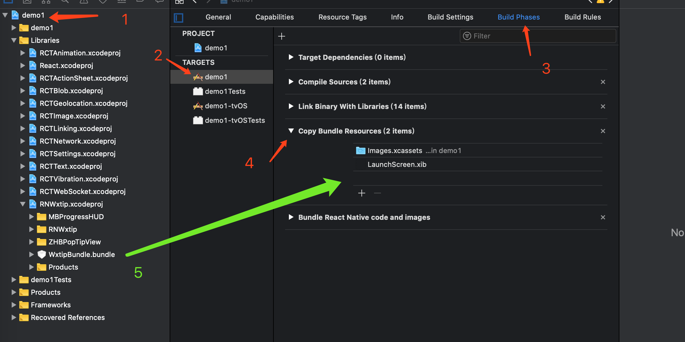
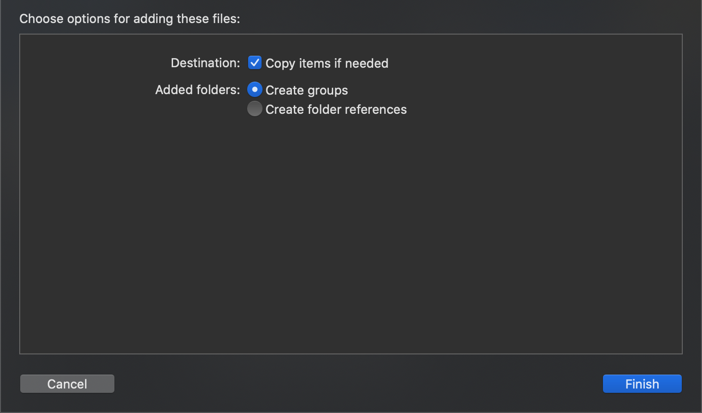
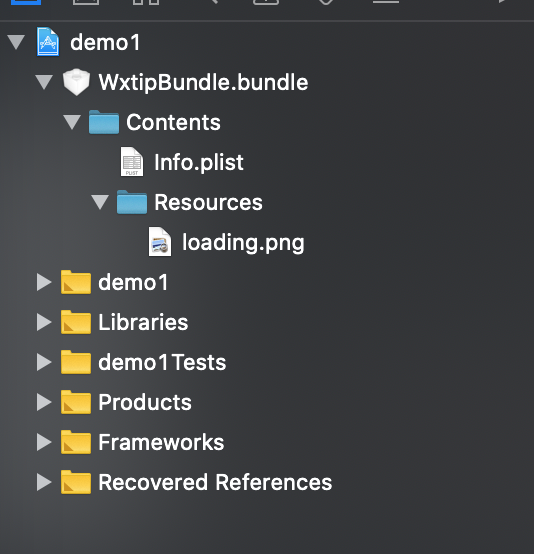

# react-native-wxtip
## [English.md](./README.en.md)
## 说明

iOS为封装MBProgressHUD

## 集成方式

### 1.为你的项目添加本库
`$ npm install react-native-wxtip --save`
或
`yarn add react-native-wxtip`

### 2.link本库
`$ react-native link react-native-wxtip`

如果你不需要自定义loading图片,那么现在已经可以运行了

如果你需要自定义图片(Android暂不支持),请往下看

### 3.iOS上(看不懂步骤的,拉倒最下面看图示)
1. 打开你的项目  选中你的target  ➜ Build Phases ➜ Copy Bundle Resources
2. 打开library,找到RNWxtip.xcodeproj ➜ WxtipBundle.bundle
3. 将WxtipBundle.bundle拖动到Copy Bundle Resources中
4. 勾选Copy items if needed 和 Create groups
5. 如果你的项目下,出现一个WxtipBundle.bundle,完成
如果需要更改loading的图片,只需要将你项目下的`WxtipBundle.bundle/Contents/Resources/loading.png `
进行替换,注意图片名和图片类型不要改变,名为loading.png

## 用法
### RN中
```
//引入WXTip
import {WXTip} from 'react-native-wxtip';

//loading展示
WXTip.showLoading();
//loading自定义图片(Android为普通loading)
WXTip.showLoadingWithImage();
//loading消失
WXTip.dismissLoading();
//弹出Toast
WXTip.showToast("hello world");

```


## iOS图示


